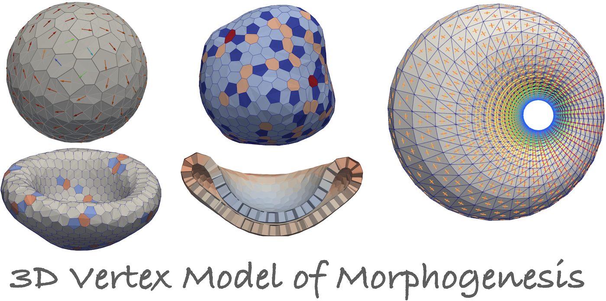

---
## Content

**[1. Introduction](#Intro)**

**[2. What is included in the current version?](#included-in-package)**

  * [2.1. Vertex model of spherical organoids.](#organoids)

  * [2.2. Random traction yielding transition in 2D spherical tissues.](#YieldingTranisiton)

  * [2.3. Three-dimensional vertex model of thick epithelial monolayers.](#ThickSph)
	  * [2.3.1. Growth by cell divisions.](#3DGrowth)
	  * [2.3.2. Inflation and deflation of enclosed lumen.](#3DLumenDeflation)

  *  [2.4. Analysis toolkit provided in ./accesories sub-folder.](#accessories)

**[3. Compiling and dependencies](#compilation)**

**[4. Usage](#use)**

**[5. Visualization and analysis of simulation data](#analysis)**

**[6. Support](#support)**

**[7. Authors, and acknowledgements](#authors)**

**[8. License and citation](#cite)**

**[9. Roadmap](#roadmap)**

----

## 1. Introduction <a name="Intro"/>

This is a vertex model of a monolayer epithelium in three dimensions.

This package can be used for 2D curved and 3D monolayer simulations with and without active forces. To learn more about the model definition, the data structures, and the implementation details, check ```VM_implementation.pdf``` file included in ./accessories/misc subfolder.

In the following you can find some necessary information that will help you use this package.

## 2. What is included in the current version? <a name="included-in-package">

### 2.1. Vertex model of spherical organoids. <a name="organoids">

Here provide some info related to organoid simulations.

### 2.2. Random traction yielding transition in spherical tissues. <a name="YieldingTranisiton">

Explain how to reproduce the simulation data reported in the random traction yielding transition paper.

### 2.3. Three-dimensional vertex model of thick epithelial monolayers. <a name="ThickSph">

3D VM explanations.

#### 2.3.1. Growth by cell divisions. <a name="3DGrowth">

explain divisions.

#### 2.3.2. Inflation and deflation of enclosed lumen. <a name="3DLumenDeflation">

explain the pressure difference and volume control.

### 2.4. Analysis toolkit provided in ./accesories sub-folder. <a name="accessories">

describe what kind of analysis can be done using this package.

## 3. Compiling and dependencies. <a name="compilation">

You need the following libraries:

* GNU Scientific Library (GSL). Open source and available at: (https://www.gnu.org/software/gsl/)
* C++ Boost libraries. Open source and available at: (https://www.boost.org/users/download/)

In addition to dependencies mentioned above, you need a modern C\+\+ compiler that supports the standard library -std=c\+\+14 or newer.
The developer has used gcc/12.2.0 and the the standard library -std=c\+\+20, and we recommend them as preferred choices.

Simply type ```make``` to compile the code.

Do you work from a work-station at MPI-PKS, or can remotely connect to one of the MPI-PKS servers?
If yes, the following steps guarantees a successful compilation:
```
- step 1: module load gcc/12.2.0
- step 2: make
```

```Note:```
In case you do not want to compile, but still would like to explore some features of the code:
    We have provided pre-compiled binaries and editable input files that you can run. To make this even more user friendly, a few python jupyter notebooks have been designed. See the ```Usage``` section.

## 4. Usage. <a name="use">

* Running the code from a terminal console:

todo: explain how this should be done.

* Running the code through a python jupyter notebook interface:

todo: explain how this should be done.

## 5. Visualization and analysis of simulation data. <a name="analysis">

Have you successfully performed some simulations and, now, would like to visualize and analyze them?

Navigate to the sub-folder ./accessories and compile the relevant code using the Makefile that is included in there by typing ```make```.

Now you can run the executable. First remember to update the runcard ```analyze.dat``` as you wish, and then type:
```
./analyze analyze.dat -d /address/to_data_directory -o /address/to_output_directory
```

probably I need to add a description of the ```analyze.dat``` runcard file.

## 6. Support. <a name="support">

If you need support or would like to report a bug, you may contact us at: ```aamiri@pks.mpg.de``` or ```aboutalebamiri@gmail.com``` and write in the email subject line "Simulation package - 3D Vertex model."


## 7. Authors, and acknowledgments. <a name="authors">

The code was developed by Aboutaleb Amiri, Charlie Duclut, Anne Materne, Marko Popovic, and Frank J&uuml;licher, as part of the BMBF grant, the project number xx.

## 8. License and citation. <a name="cite">

We have not issued a license policy yet.

If you use this package, please cite where this package is published: (provide a url link)


## 9. Roadmap. <a name="roadmap">

Things to do in the future releases.
